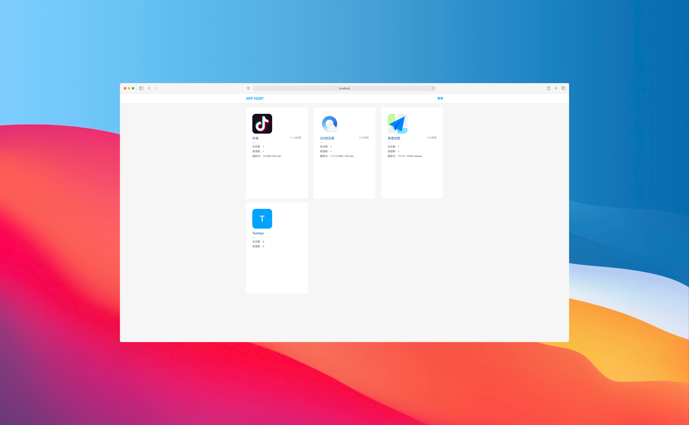
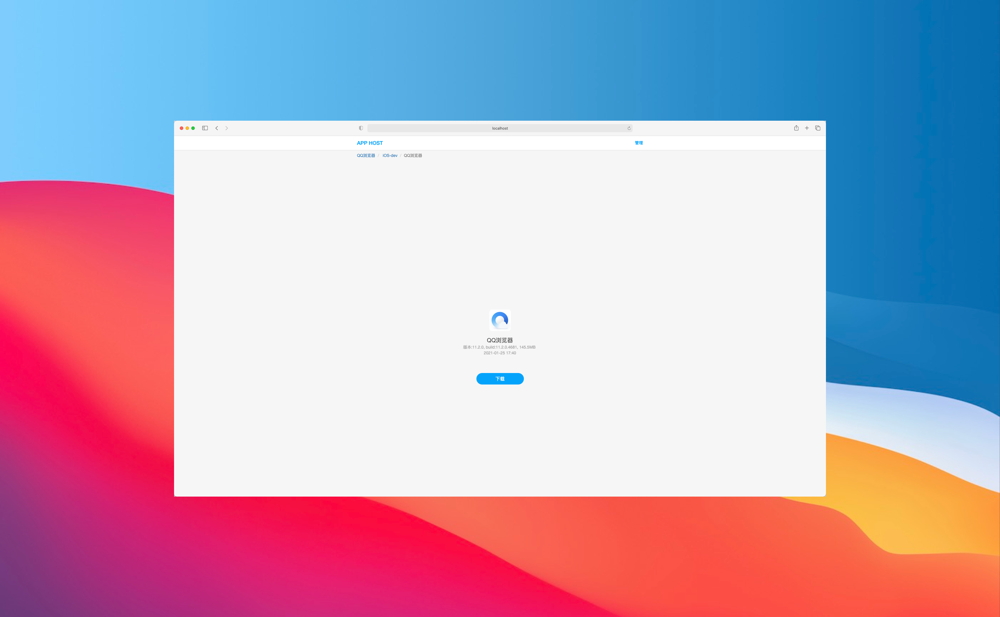
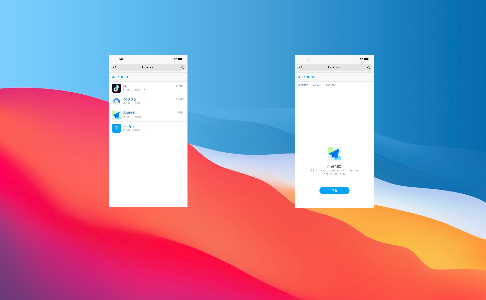

# AppHost


[](https://travis-ci.org/pluosi/app-host)
[](https://travis-ci.org/pluosi/app-host)
[]()

## 介绍
一个轻量级的包托管网站，app-host 主要用于 iOS 和 Android 的包管理，作用类似于fir.im，不同之处是可以自由部署在内网，方便了公司项目保密。并且代码开源也可以方便根据各自需求进行定制化开发。


## 目前能实现
1.新建包<br>
2.包底下新建渠道（ iOS，安卓，各种环境都归为渠道，例如 iOS 生产，iOS 沙盒，iOS 越狱版，Android 生产等）<br>
3.渠道下面上传包<br>
4.帐号和权限管理<br>
5.api 和页面表单上传包<br>
6.解析包信息，包括 iOS 的包类型 ADHOC 还是 release，udid，安卓的签名证书等<br>
7.我编不下去了···哈哈~~<br>


## 推荐用法 Docker 公有镜像
```
1. 把~/shared目录添加到Docker -> Preferences... -> Resources中（授权访问）
2. docker run --name app_host -v ~/shared:/app/shared -p 3000:8686 -d tinyc/app-host:lastest
```

## 用法 2 Docker 自己编译
```
1. > git clone https://github.com/pluosi/app-host.git /opt/app-host
2. > cd /opt/app-host
5. > ./docker/launcher bootstrap -v #该步骤依赖网络，所以如果网络不稳定报错了，可以重试几次
6. > ./docker/launcher start
7. 尝试访问 http://localhost:3000 ,如果不希望用3000端口，可以手动修改 docker/launcher 里的`local_port`值
ps:数据库和上传的文件会保存在 ./shared 文件夹中
```

## 用法 3 源码运行
```
1. > git clone https://github.com/pluosi/app-host.git /opt/app-host
2. > cd /opt/app-host
4. 修改 config/secrets.yml 中 `production下的secret_key_base` ,可以运行`rake secret`得到
5. bundle install
6. rails s 运行测试环境
7. 关于部署到生成环境的话请参照一下 rails puma 部署等教程，需要修改一下 config/deply.rb 的部署地址
8. 尝试访问 http://localhost:3000
```

## 关于 https
如果需要用到ipa下载，必须配置 https，举例 ng 的配置参考
```
//https_app.conf
server {
    listen 443 ssl;
    server_name  ota.xxx.com;
    
    # access_log /var/log/nginx/ota.xxx.com_access.log;

    ssl_certificate      /home/xxx.com/nginx/public.pem;
    ssl_certificate_key  /home/xxx.com/nginx/private.key;
    ssl on;

    location / {
        proxy_set_header  Host $http_host;
        proxy_set_header  X-Real-IP $remote_addr;
        proxy_set_header  X-Forwarded-For $proxy_add_x_forwarded_for;
        proxy_set_header  X-Forwarded-Proto https;
        proxy_set_header  X-Forwarded-Port $server_port;
        proxy_pass http://172.21.35.62:3000; #此处改为 docker 服务的地址
    }
}

server {
    listen 80;
    server_name ota.xxx.com;
    rewrite ^(.*)$  https://$host$1 permanent;
}
```

## 已知问题
1. apk 包如果是非图片 logo，会无法显示 logo，因为目前还没实现 xml logo 的解析
2. 如果不配置 https，ipa 将无法安装（苹果的限制）


## License
AppHost is released under the MIT license. See LICENSE for details.

## 联系作者


## 预览







 
