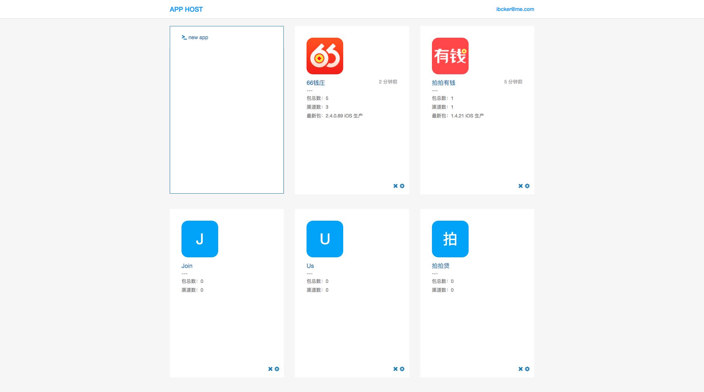
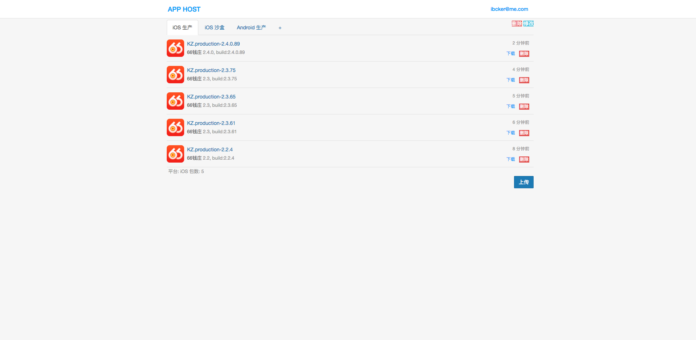
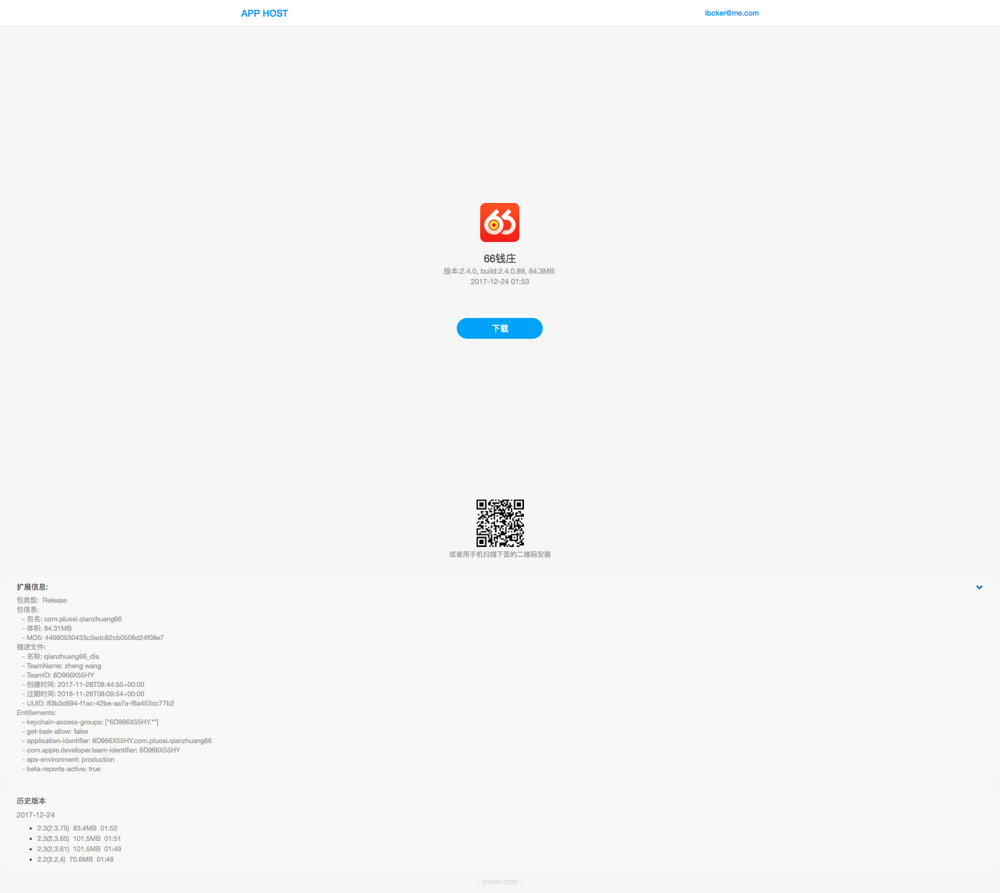
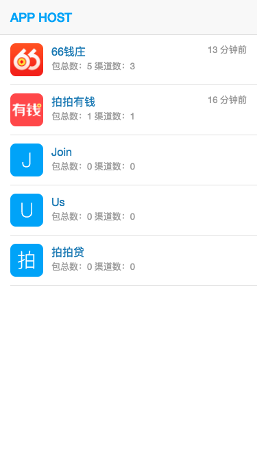
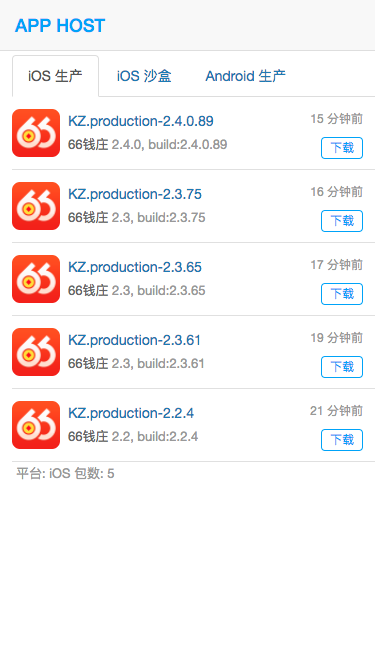
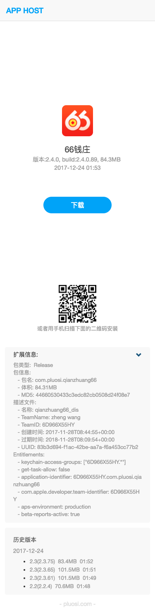

# AppHost

## 介绍
一个轻量级的包托管网站，app-host 主要用于 iOS 和 Android 的包管理，作用类似于fir.im，不同之处是可以自由部署在内网，方便了公司项目保密。并且代码开源也可以方便根据各自需求进行定制化开发。

## 目前能实现
1.新建包 
2.包底下新建渠道（ iOS，安卓，各种环境都归为渠道，例如 iOS 生产，iOS 沙盒，iOS 越狱版，Android 生产等） 
3.渠道下面上传包 
4.帐号和权限管理 
5.api 和页面表单上传包 
6.解析包信息，包括 iOS 的包类型 ADHOC 还是 release，udid，安卓的签名证书等 
7.我编不下去了···哈哈~~ 

## 用法
1. 改名 settings.local.example.yml 为 config/settings.local.yml
2. 修改 config/settings.local.yml 中 `PROTOCOL` 和 `HOST` ,本地测试PROTOCOL可以为 http,生产环境必须设置为https,因为 iOS OTA 安装需要
3. bundle install
4. rails s
5. 关于部署到生成环境的话请参照一下 rails puma 部署等教程，需要修改一下 config/deply.rb，如果不是很着急用，可以等一下 docker 的版本

## 已知问题
1. 目前只以单线程运行，因为ruby_android这个 gem 在解压 apk 时内存消耗很大，开的线程多了会跑满内存被系统干掉。当然，机器内存大的可以直接修改 config/puma.rb 里的 threads_max 数量

## License
AppHost is released under the MIT license. See LICENSE for details.

## 截图-PC

## 截图-Mobile

 
